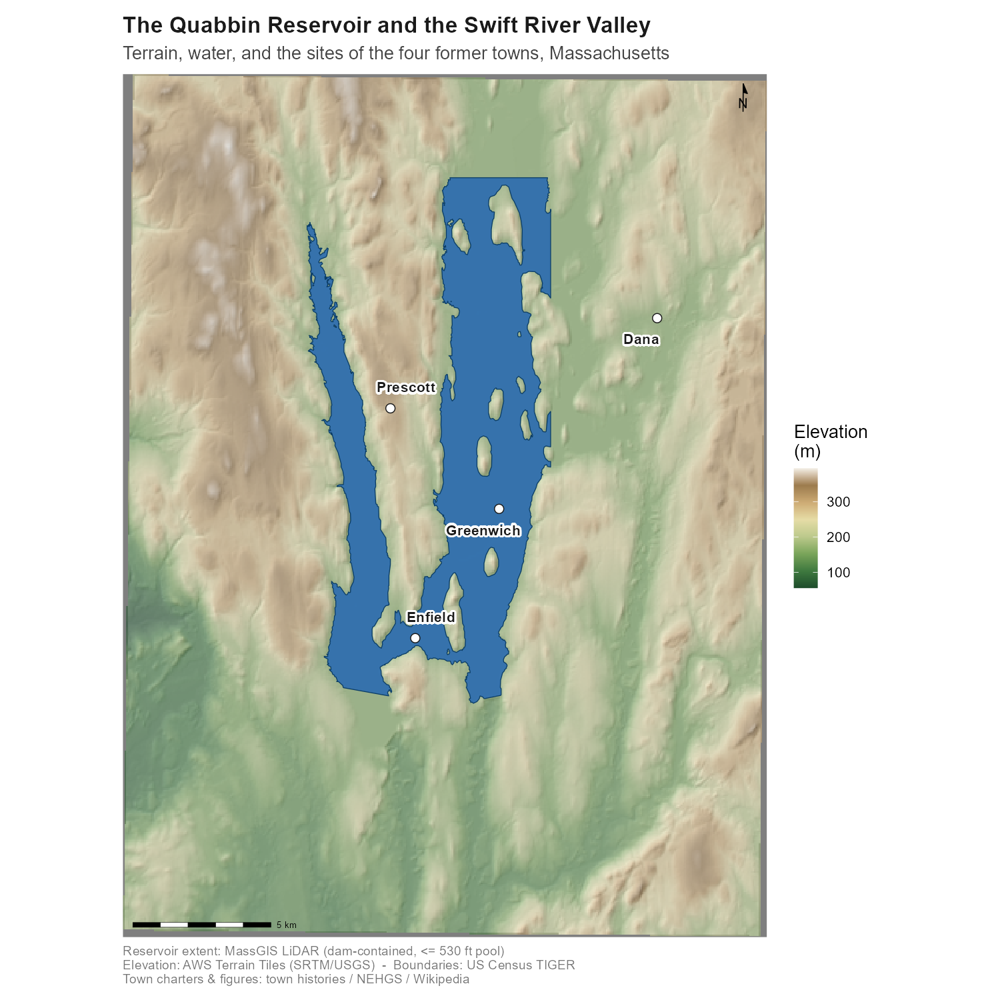
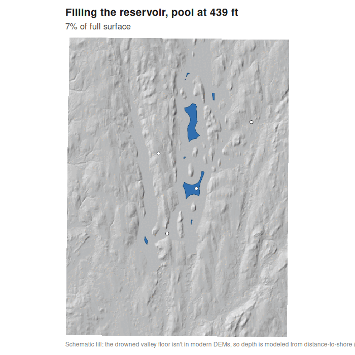

# The Quabbin Reservoir and the Lost Towns of the Swift River Valley

A reproducible **R** GIS study of the Quabbin Reservoir, Massachusetts, created
between 1938 and 1946 by damming and flooding the Swift River Valley. Four towns
— **Dana, Enfield, Greenwich, and Prescott** — were disincorporated on 28 April
1938 and about 2,500 residents were relocated; the reservoir supplies
metropolitan Boston, roughly 105 km (65 miles) to the east.

It is a *multi-layer study*: several spatial layers that, read together, describe
how the reservoir was sited and what it replaced — a valley whose terrain forms a
natural basin, four towns that had been losing population for decades, and a
present-day map in which their land has been absorbed by the surrounding towns.



## The layers

| # | Figure | What it shows | Source |
|---|--------|---------------|--------|
| 1 | `01_locator.png` | The reservoir's location in Massachusetts | TIGER + DEM-derived water |
| 2 | `02_dem_hillshade.png` | The Swift River Valley basin (shaded relief) | AWS Terrain Tiles (elevatr) |
| 3 | `03_reservoir_towns.png` | The four former towns over the present reservoir | DEM + town points |
| 4 | `04_watershed.png` | The reservoir within its drainage (regional context) | USGS WBD HUC-10 |
| 5 | `05_erasure.png` | The former town land, now divided among surrounding towns | TIGER municipalities |
| 6 | `06_town_lifelines.png` | Each town's span, charter to the 1938 disincorporation | town records |
| 7 | `07_population_decline.png` | Decennial census population, 1900–1920 | US Census 1920 (Number of Inhabitants) |
| 8 | `08_hero.png` | Terrain, reservoir, and the former town sites together | all of the above |
| 9 | `09_floodfill.png` | The reservoir filling in stages to the 530-ft full pool | DEM |
| 10 | `10_aqueduct.png` | The aqueduct route, ~105 km east to Boston | hand-placed coordinates |
| 11 | `11_crosssection.png` | West-east valley cross-section at the 530-ft pool | DEM |
| 12 | `12_losses.png` | "By the numbers": what was removed and what is supplied | MWRA / DCR / histories |
| 13 | `13_terrain3d.png` | 3D view of the valley and reservoir | DEM (`persp`) |
| 14 | `14_dana_lidar.png` | Dana Common in 1 m LiDAR (surviving town site) | USGS 3DEP LiDAR |
| 15 | `15_prescott_lidar.png` | The Prescott Peninsula in 1 m LiDAR | USGS 3DEP LiDAR |
| 16 | `16_roads.png` | The valley's 1893 road network, with the reservoir overlaid | 1893 USGS quad |
| 17 | `24_prescott_survey.png` | The whole Prescott Peninsula: 1893 survey vs. the LiDAR imprints surviving today | MassGIS LiDAR (3-tile mosaic) + 1893 quad |
| 18 | `24_enfield_survey.png` | Enfield (Winsor Dam): surviving roads on the dry south vs. the drowned center | MassGIS 1 m LiDAR + 1893 quad |
| 19 | `24_dana_survey.png` | Dana Common: the surviving common/ridge vs. the drowned village | MassGIS 1 m LiDAR + 1893 quad |
| 20 | `25_prescott_xref.png` | Ground-truth: the 1893 road network extracted and cross-referenced against the LiDAR traces | MassGIS LiDAR + 1893 quad |

Plus a **reservoir-filling animation** (`quabbin_floodfill.gif`) and an
**interactive LiDAR imprint explorer** in [`map/`](map/) (mobile-first Leaflet):
a **"ghost relief"** layer covering the *whole* reservoir in bare-earth LiDAR —
pan and zoom across every acre the reservoir spared to hunt the relict **streets,
house-lot outlines and cellar-hole pits** of the drowned villages still imprinted
in the ground (crisp 1 m tiles at the surviving village sites). Toggle the
auto-traced lines and the 1893 ground-truth survey, raise the pool over the
valley, and follow the aqueduct east to Boston.



## Running it

R is the only requirement. On Ubuntu the heavy spatial stack installs as
binaries (no source compiles):

```bash
sudo apt-get install -y r-base-core r-cran-sf r-cran-terra r-cran-raster \
    r-cran-ggplot2 r-cran-dplyr libcurl4-openssl-dev libxml2-dev libjpeg-dev
Rscript -e 'install.packages(c("elevatr","osmdata","tigris","ggspatial","ggnewscale","ggrepel","patchwork"))'
```

Then, from the repository root:

```bash
Rscript quabbin/run_all.R
```

Downloads are cached under `quabbin/data/cache/` (git-ignored), so the first
run takes a few minutes and every run after that is ~90 seconds — except the
imprint survey (stages 14–15), which mosaics the Prescott Peninsula and is
cache-guarded: its first build takes several minutes, then later runs skip any
area whose `output/24_*_survey.png` (or `25_prescott_xref.png`) already exists
(delete one to force a rebuild). The twenty-one figures and the GIF land in `quabbin/output/`; the web-map
GeoJSON, the 1893 overlay, and the LiDAR imprint overlays land in
`quabbin/map/data/`. (The GIF needs
ImageMagick — `apt-get install imagemagick`; without it the pipeline still
produces the panel `09`.)

The interactive map is static files — serve `quabbin/map/` over HTTP, e.g.
`python3 -m http.server --directory quabbin/map`, then open `localhost:8000`.

## How it is built

```
quabbin/
├── run_all.R              one-command reproduction
├── R/
│   ├── 00_setup.R         packages, CRS (EPSG:26986), area of interest, palettes
│   ├── 01_fetch_data.R    elevatr DEM · OSM/DEM reservoir · TIGER towns · USGS watershed
│   ├── 02_build_layers.R  reproject, hillshade, carve the reservoir, assemble layers
│   ├── 03_maps.R          the six spatial figures (shaded relief + vector overlays)
│   ├── 04_population.R    the two displacement charts (real census + lifelines)
│   ├── 05_floodfill.R     reservoir-filling frames + GIF + small-multiples + stage GeoJSON
│   ├── 06_aqueduct.R      the aqueduct-to-Boston map + infrastructure GeoJSON
│   ├── 07_export_web.R    export towns/reservoir/watershed GeoJSON for the web map
│   ├── 08_profile.R       west-east valley cross-section
│   ├── 09_losses.R        the "by the numbers" figure
│   ├── 10_terrain3d.R     3D terrain view (base-R persp)
│   ├── 11_preflood.R      process the 1893 USGS quad into the web overlay
│   ├── 12_lidar.R         USGS 3DEP LiDAR of Dana Common & the Prescott Peninsula
│   ├── 13_roads.R         the valley's 1893 road network, reservoir overlaid
│   ├── 14_imprints.R      LiDAR imprint survey (MassGIS) + per-town survey figures
│   ├── 15_xref.R          cross-reference: extracted 1893 roads vs the LiDAR traces
│   └── 16_reservoir.R     full-reservoir "ghost relief" coverage for the explorer
├── data/
│   ├── drowned_towns.csv  the four towns: location, county, charter & end dates
│   └── town_population.csv real US Census counts 1900–1920 + peaks + 1938 dissolution
├── map/                   interactive imprint explorer (index.html + vendored Leaflet)
│   └── data/              GeoJSON + 1893 overlay + LiDAR ghost/imprint overlays (05–16)
└── output/                the rendered figures + GIF (committed)
```

Every network fetch in `01_fetch_data.R` is wrapped so one unreachable service
never breaks the run — it degrades to a documented fallback instead.

## Data, methods, and honest caveats

- **Elevation** — AWS Terrain Tiles (SRTM/USGS, public domain) via
  `elevatr::get_elev_raster(z = 11)`, reprojected to NAD83 / Massachusetts
  Mainland (EPSG:26986) and hillshaded with `terra`.
- **Reservoir** — by default **carved from the DEM** at Quabbin's 530-ft
  full-pool surface (the single largest contiguous polygon below that
  elevation). This needs no external service and ties the water directly to the
  terrain. An OpenStreetMap shoreline path (`RESERVOIR_METHOD <- "osm"`) is
  available but opt-in, because public Overpass servers frequently rate-limit
  or block cloud IPs.
- **Watershed** — USGS Watershed Boundary Dataset HUC-10 units (public domain),
  queried live from the National Map ArcGIS service. **These are deliberately
  shown as regional context, not as the catchment boundary:** the dissolved
  HUC-10s are several times larger than the ~120 sq mi DCR-defined Quabbin
  watershed (a MassGIS layer that was not reachable here). The map says so.
- **Modern municipalities** — US Census TIGER county subdivisions (2021,
  public domain) via `tigris`.
- **The four towns** — there is no clean, freely downloadable historic GIS
  boundary for towns abolished in 1938, so they are plotted as labeled points
  at their historic centers (coordinates from the towns' Wikipedia pages).
- **Population** — real decennial **U.S. Census** counts for all four towns, read
  straight from the 1920 *Number of Inhabitants, Massachusetts* bulletin (Table 2,
  public domain), via OCR + a hand check of the scanned page: for 1900 / 1910 /
  1920, Dana 790 → 736 → 599, Enfield 1,036 → 874 → 790, Greenwich 491 → 452 →
  309, Prescott 380 → 320 → 236. Every town was already shrinking before the
  reservoir. Earlier peaks (Enfield ~1,100 in 1850, Prescott ~750 in 1830) and
  the 1938 dissolution (~2,500 displaced in all) are shown as annotated context,
  not plotted as census points. All four disincorporated **28 April 1938**.
- **Reservoir-filling animation** — `05_floodfill.R` carves the full-pool
  footprint once, then fills it in **equal-area stages** on a lightly smoothed DEM
  (the broad, shallow basin would otherwise flood most of its area in the final
  elevation step). Frames become a GIF (ImageMagick) and a small-multiples panel,
  and the per-stage polygons are exported as GeoJSON for the map slider. Stages
  are by pool level / area, not surveyed year-by-year fill data (the real fill
  window, 1939–1946, is annotated).
- **Aqueduct & dams** — the route (Quabbin → Wachusett → Boston) and the dams
  (Winsor Dam, Goodnough Dike) are **hand-placed from known coordinates** and
  labeled schematic; they convey the ~105 km eastward course of the water, not a
  surveyed alignment.
- **Cross-section** (`08_profile.R`) — a west-east transect of the DEM at the
  reservoir's widest point. The DEM retains sub-pool relief of the drowned valley,
  but its underwater values are approximate, so the figure cites the surveyed
  maximum depth (~150 ft) rather than asserting DEM depths.
- **By the numbers** (`09_losses.R`) — documented quantities (surface area,
  volume, shoreline, displaced residents, relocated graves, buildings razed,
  people supplied) compiled from MWRA, Massachusetts DCR, and regional histories;
  several vary by source and are shown with ranges.
- **3D view** (`10_terrain3d.R`) — base-R `persp()` (no GPU required), with the
  reservoir drawn as a flat pool over the relief.
- **Pre-reservoir map** (`11_preflood.R`) — the 1893 USGS Belchertown 15-minute
  quadrangle (Historical Topographic Map Collection, public domain), reprojected
  to EPSG:4326, cropped to the neatline, and exported as a JPEG + bounds for the
  fade overlay in the interactive map.
- **LiDAR of the surviving sites** (`12_lidar.R`) — 1 m bare-earth LiDAR from the
  USGS 3DEP dynamic elevation service (public domain) for Dana Common and the
  Prescott Peninsula, the two areas above the full pool. A denoised low-sun
  hillshade carries the terrain; a local relief model (elevation minus its local
  mean) then flags genuine depressions deeper than ~0.5 m — cellar holes and road
  cuts — in red, with a slope mask so natural gullies on the flanks aren't false-
  flagged. Exported as land-only overlays (transparent over water) for the map.
  Submerged areas are not shown: the buildings were demolished and LiDAR cannot
  penetrate water, and the conservative threshold under-flags rather than fills the
  frame with canopy noise.
- **The valley's road network** (`13_roads.R`) — renders the real Swift River
  Valley roads from the georeferenced 1893 USGS Belchertown quadrangle, with the
  present reservoir overlaid in blue so you can see which roads and villages
  drowned. The four town centres are marked and the routes out to the surviving
  neighbours are labelled at the frame edges.
- **The LiDAR imprint survey** (`14_imprints.R`) — the heart of the relict-landscape
  work. For the dry land that survives in each town it pulls **MassGIS 1 m bare-earth
  LiDAR** (the 2013–2021 statewide DEM ImageServer, public domain; native NAD83 / MA
  metres, cleaner than the 3DEP seamless used in `12_lidar.R`) and renders a
  **composite relief** — an 8-direction hillshade emphasised by a Local Relief Model
  — that makes faint linear features read. It then **auto-traces** the relict network:
  elongated *negative* relief (sunken roadbeds, cart paths) and elongated *positive*
  relief (banks, stone walls), keeping only long, straight connected components on
  gentle ground so blobs and slope noise are dropped. Every panel is ground-truthed
  against the 1893 quad. Findings, honestly: **Prescott** is the richest (a clear road
  plus many lineations); **Enfield**'s dry south (toward Winsor Dam) keeps road traces;
  **Dana**'s common/ridge keeps a road cut; **Greenwich**'s center is *entirely* under
  water (a static "what drowned" panel, no imprints). The auto-trace is a **candidate**
  finder — it cannot perfectly separate man-made lines from natural slope features, so
  the relief itself is the primary evidence and the traces are an explorable overlay.
  This is, as far as we found, a gap in the public record: the lost-town history is
  well documented (J.R. Greene's *Atlas of the Quabbin Valley*; the Swift River Valley
  Historical Society) and LiDAR for New England relict landscapes is proven (UConn's
  Ouimet Lab; Johnson & Ouimet 2014), but not combined into a LiDAR imprint survey of
  the four towns. The Prescott Peninsula runs ~12 km — beyond the server's single-export
  cap — so it is mosaicked from three ~2 m strips into one DEM for full-length coverage;
  the stage is cache-guarded (skips any area whose survey figure already exists), so only
  the first build pays the render cost. Exported as static survey figures (`output/24_*`)
  and as web overlays (relief + traces, transparent over water) with bounds in
  `map/data/imprints.json`.
- **Interactive imprint explorer** — Leaflet (vendored locally, no CDN dependency),
  mobile-first: a full-screen map, bottom-sheet **Layers** control, big touch targets,
  a full-width pool slider, and zoom to z19. It serves the full-reservoir **ghost relief**
  (above) as its primary layer, the auto-traced lines, "jump to" buttons (whole reservoir /
  Prescott Center / Dana Common), the 1893 fade overlay, the drowned-town popups, the flood
  stages, and the aqueduct, over Esri World Hillshade + CARTO label tiles. The basemap tiles
  need internet; every layer the study itself produces is served locally.
- **Full-reservoir "ghost relief"** (`16_reservoir.R`) — the explorer's headline layer.
  It tiles the *entire* Quabbin land area in MassGIS bare-earth LiDAR and renders each
  tile as a fine Local Relief Model (elevation minus its local mean over ~13 cells) —
  the rendering that makes the drowned villages' street plans, house-lot outlines and
  cellar-hole pits read directly in the bare ground — transparent over water. Broad
  coverage is ~2 m with a fixed contrast span so tiles match seamlessly; the surviving
  village sites (Prescott Center, Dana Common) get crisp ~1 m tiles. Turn on **Ghost
  relief** in the explorer and zoom in to hunt footprints anywhere the reservoir spared.
  Downloads are cache-guarded (the slow part); re-runs re-export quickly. Exits to web
  overlays + `map/data/reservoir_ghost.json`.
- **Ground-truth cross-reference** (`15_xref.R`) — closes the loop on the imprints:
  it extracts the 1893 road network straight from the quad (dark, low-saturation
  linework, morphologically closed, kept only where elongated → roads, not text),
  then classifies the LiDAR road traces by proximity — within 14 m of a mapped 1893
  road = a **confirmed surviving roadbed** (green), the rest unverified (orange).
  Demonstrated on the mid-peninsula (the old Prescott village area). **Honest limit:**
  auto-extraction of the scanned linework catches the main roads, not the full
  network, so "unverified" is *not* "newly discovered"; the explorer's 1893 fade
  overlay remains the fuller visual ground-truth. Renders `output/25_prescott_xref.png`.

## Stack

`R` · `sf` · `terra` · `elevatr` · `osmdata` · `tigris` · `ggplot2` ·
`ggnewscale` · `ggrepel` · `ggspatial` · `patchwork` · ImageMagick · Leaflet · GDAL 3.8

---
*Part of an ongoing series of multi-layer GIS studies of geography-shaped
American places. Data is open; figures are reproducible from the scripts above.*
